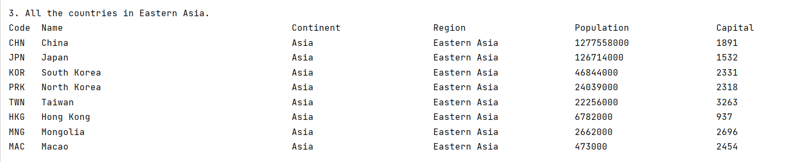
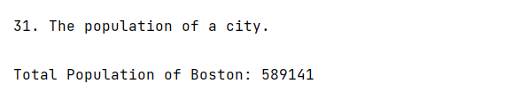

<h1>SET09623 2022-3 TR2 001 - DevOps (Group 2)</h1> 

# Team roles

| Role          | Member Name      | Matric No |
|---------------|------------------|-----------|
| Product Owner | Kyaw Hsu Thway   | 40516572  |
| Scrum Master  | Hsu Yati Khin    | 40516605  |
| Team Member   | Aye Thandar Phyo | 40524297  |
| Team Member   | Su Yadana Win    | 40542804  |

## Contribution Spreadsheet of the team
| Name | Code Review 1 | Code Review 2 | Code Review 3 | Code Review 4 | Final Deliverable |
|-----------|---------------|---------------|---------------|---------------|--|
| Kyaw Hsu Thway    | 0.25            | 0.25           | 0.25            | 0.25           | 0.25     |    
| Hsu Yati Khin     | 0.25            | 0.25           | 0.25            | 0.25           | 0.25     |    
| Aye Thandar Phyo  | 0.25            | 0.25           | 0.25            | 0.25           | 0.25     |     
| Su Yadana Win     | 0.25            | 0.25           | 0.25            | 0.25           | 0.25     |

## Workflow Action and Build Badges
* WorkFlow Action 

* Master  Build  

* Develop  Build  

* Apache License 

* Release 

* Code of Conduct 

[//]: # (* Code Coverage [![codecov]&#40;https://codecov.io/gh/hsuyatikhin-alissa/group2/branch/master/graph/badge.svg?token=GR5UHCYCPW&#41;]&#40;https://app.codecov.io/gh/hsuyatikhin-alissa/group2/tree/master&#41;)

* Code Coverage 

## Link to Our Project from Zube
https://zube.io/group-2-3/group-2/w/workspace-1/kanban

# 32 requirements of 32 have been implemented, which is 100%.
| ID | Name                                                                                                                                                                  | Met | Screenshot                   |
| --- |-----------------------------------------------------------------------------------------------------------------------------------------------------------------------| --- |------------------------------|
| 1 | All the countries in the world organised by largest population to smallest.                                                                                           | Yes |   |
| 2 | All the countries in a continent organised by largest population to smallest.                                                                                         | Yes |   |
| 3 | All the countries in a region organised by largest population to smallest.                                                                                            | Yes |   |
| 4 | The top N populated countries in the world where N is provided by the user.                                                                                           | Yes |   |
| 5 | The top N populated countries in a continent where N is provided by the user.                                                                                         | Yes |   |
| 6 | The top N populated countries in a region where N is provided by the user.                                                                                            | Yes |   |
| 7 | All the cities in the world organised by largest population to smallest.                                                                                              | Yes |   |
| 8 | All the cities in a continent organised by largest population to smallest.                                                                                            | Yes |   |
| 9 | All the cities in a region organised by largest population to smallest.                                                                                               | Yes |   |
| 10 | All the cities in a country organised by largest population to smallest.                                                                                              | Yes |  |
| 11 | All the cities in a district organised by largest population to smallest.                                                                                             | Yes |  |
| 12 | The top N populated cities in the world where N is provided by the user.                                                                                              | Yes |  |
| 13 | The top N populated cities in a continent where N is provided by the user.                                                                                            | Yes |  |
| 14 | The top N populated cities in a region where N is provided by the user.                                                                                               | Yes |  |
| 15 | The top N populated cities in a country where N is provided by the user.                                                                                              | Yes |  |
| 16 | The top N populated cities in a district where N is provided by the user.                                                                                             | Yes |  |
| 17 | All the capital cities in the world organised by largest population to smallest.                                                                                      | Yes |  |
| 18 | All the capital cities in a continent organised by largest population to smallest.                                                                                    | Yes |  |
| 19 | All the capital cities in a region organised by largest to smallest.                                                                                                  | Yes |  |
| 20 | The top N populated capital cities in the world where N is provided by the user.                                                                                      | Yes |  |
| 21 | The top N populated capital cities in a continent where N is provided by the user.                                                                                    | Yes |  |
| 22 | The top N populated capital cities in a region where N is provided by the user.                                                                                       | Yes |  |
| 23 | The population of people, people living in cities, and people not living in cities in each continent.                                                                 | Yes |  |
| 24 | The population of people, people living in cities, and people not living in cities in each region.                                                                    | Yes |  |
| 25 | The population of people, people living in cities, and people not living in cities in each country.                                                                   | Yes |  |
| 26 | The population of the world.                                                                                                                                          | Yes |  |
| 27 | The population of a continent.                                                                                                                                        | Yes |  |
| 28 | The population of a region.                                                                                                                                           | Yes |  |
| 29 | The population of a country.                                                                                                                                          | Yes |  |
| 30 | The population of a district.                                                                                                                                         | Yes |  |
| 31 | The population of a city.                                                                                                                                             | Yes |  |
| 32 | The number of people who speak the Chinese,English,Hindi,Spanish,Arabic languages from greatest number to smallest, including the percentage of the world population. | Yes |  |

